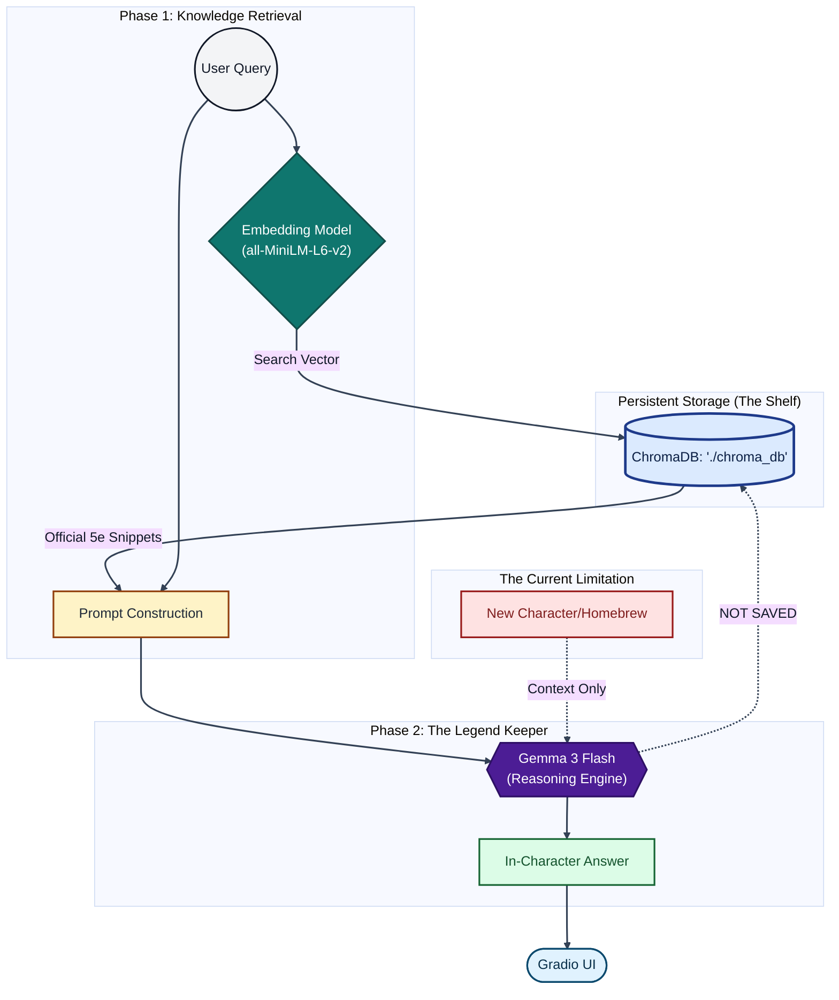

## Legend Keeper

Legend Keeper is a D&D-focused backstory and lore assistant. It combines a local/vector lore search layer with an instruction-tuned language model so responses stay immersive, in-character, and grounded in campaign context.

### What this project does

- Generates character backstories from simple inputs (name, class, race, vibe).
- Retrieves relevant lore snippets from a persistent ChromaDB collection.
- Keeps a narrative persona ("The Legend Keeper") with strict guardrails.
- Supports follow-up chat while preserving story continuity.

### How the code works

#### 1) `LoreLibrarian` handles retrieval

- File: `src/librarian.py`
- `LoreLibrarian` connects to a persistent ChromaDB path (`data/lore_db` by default, or a user-provided path).
- It binds to collection `dnd_lore` (or falls back to the only available collection).
- `search()` runs semantic lookup and returns top lore passages as plain text context.

#### 2) `LegendKeeper` handles generation

- File: `src/generator.py`
- `LegendKeeper` loads persona rules from `configs/prompts.yaml`.
- It initializes a 4-bit quantized text-generation pipeline (`transformers` + `bitsandbytes`) for efficient local/Colab inference.
- `generate_backstory()` starts a new guarded story session and injects retrieved lore.
- `chat()` appends user input, injects context each turn, generates with continuation safeguards, and trims incomplete endings.

#### 3) Prompt configuration controls behavior

- File: `configs/prompts.yaml`
- Centralizes identity, safety constraints, formatting, tone, and interaction rules.
- Keeps behavior editable without changing Python logic.

### Current dependencies (high level)

- LLM/runtime: `transformers`, `torch`, `accelerate`, `bitsandbytes`
- Retrieval/DB: `chromadb`, `sentence-transformers`
- Supporting tools: `pyyaml`, `python-dotenv`, and LangChain modular packages

### AI tooling disclosure

This project used AI tools during development (including coding assistants and LLM support) to help draft, refactor, and document code. Final project structure, validation, and behavioral decisions were reviewed and curated by the maintainer.

### System architecture

